### Hello there 👋

<!--
**Nestoro/Nestoro** is a ✨ _special_ ✨ repository because its `README.md` (this file) appears on your GitHub profile.

Here are some ideas to get you started:

- 🔭 I’m currently working on ...
- 🌱 I’m currently learning ...
- 👯 I’m looking to collaborate on ...
- 🤔 I’m looking for help with ...
- 💬 Ask me about ...
- 📫 How to reach me: ...
-->

You can play Tetris [here](https://nestoro.de/tetris "Tetris")
        
 
    

    
    

 

### 🔥 Languages

    <!-- languages -->
    
    
    
    
    
    
    
    
    
    

### ⚙️ Frameworks

    <!-- js -->
    
    
    
    
    
    
    

### 💾 Databases & Protocols    

    <!-- web / db -->
    
    
    
    

### 🛠️ Tools

    <!-- tools -->
    
    
    
    
    
    
    
    
    
    
    
    

